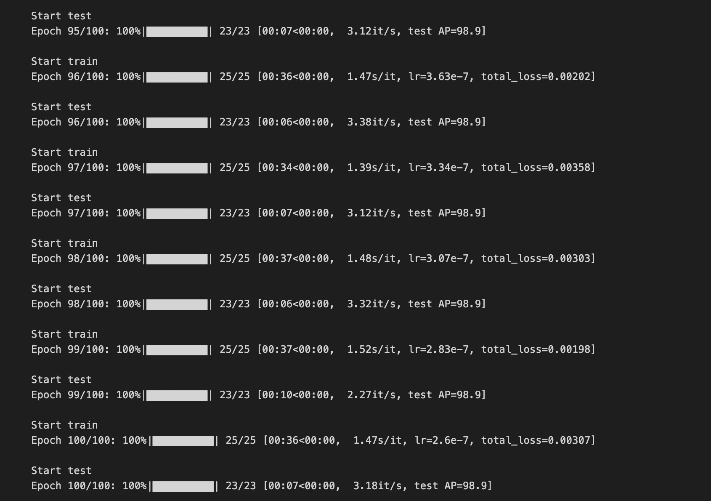

[日本語](README.md) | **中文** | [English](README_EN.md)

# **收据图像旋转校正模型（分类模型）**

## **概述**
本项目使用基于 **ResNet34** 的分类模型，判断收据图像的旋转角度（0°、90°、180°、270°），并自动将图像校正回 0°。

以下示例展示了模型检测 270° 旋转的图像并自动校正为 0° 的过程。

<div align="medium">
   
</div>

## **项目结构**

```
├── data/
│   ├── train/images/      # 训练图像
│   ├── test/images/       # 测试图像
│   └── valid/images/      # 验证图像
├── datamodule/
│   └── dataloader.py      # 数据集与预处理
├── nets/
│   ├── blocks.py          # 卷积块定义
│   ├── resnet.py          # ResNet34 模型定义
│   └── README.md
├── plotmodule/
│   └── plot_utils.py      # 可视化工具
├── debug_images/
│   └── debug_utils.py     # 调试图像保存
├── figure/                # README 用图片
├── logs/                  # 训练好的模型 (.pth)
├── data_load_train.py     # 训练脚本
├── prediction.py          # 推理与校正脚本
├── README.md              # 日语版
├── README_EN.md           # 英语版
└── README_ZH.md           # 本文件（中文版）
```

## **数据集准备**

将训练图像放入 `data/train/images/`，测试图像放入 `data/test/images/`。所有图像应保持正向（0°），代码会自动生成 90°、180°、270° 的旋转版本，形成 4 类数据集。

- **类别 0**: 0°（正向）
- **类别 1**: 向左旋转 90°
- **类别 2**: 旋转 180°
- **类别 3**: 向左旋转 270°（= 向右旋转 90°）

 

## **处理流程**

### 1. 数据预处理 — [dataloader.py](datamodule/dataloader.py)

`RotatedReceiptDataset` 类加载图像并为每张图像生成 4 个旋转版本。预处理包括：

- **缩放**: 所有图像统一为 224×224 像素
- **归一化**: 每个 RGB 通道归一化为 `[0.5, 0.5, 0.5]`

```python
data_transforms = transforms.Compose([
    transforms.Resize((224, 224)),
    transforms.ToTensor(),
    transforms.Normalize([0.5, 0.5, 0.5], [0.5, 0.5, 0.5])
])
```

### 2. 训练与验证 — [data_load_train.py](data_load_train.py)

| 配置 | 值 |
|------|-----|
| 模型 | ResNet34 |
| 损失函数 | CrossEntropyLoss |
| 优化器 | Adam |
| 学习率 | 0.001（初始） |
| 调度器 | StepLR（gamma=0.92） |
| 批次大小 | 8 |
| 训练轮数 | 10（可自定义） |

训练完成后，模型将保存在 `logs/` 目录中。

<div align="medium">
   
</div>

### 3. 推理与角度校正 — [prediction.py](prediction.py)

使用训练好的模型预测图像旋转角度，并校正回 0°。

```python
# 根据预测标签旋转图像
def correct_image_orientation(image, predicted_label):
    if predicted_label == 1:
        return image.rotate(270, expand=True)  # 90° → 0°
    elif predicted_label == 2:
        return image.rotate(180, expand=True)  # 180° → 0°
    elif predicted_label == 3:
        return image.rotate(90, expand=True)   # 270° → 0°
    return image  # 已经是 0°
```

## **使用方法**

```bash
# 训练
python3 data_load_train.py

# 推理
python3 prediction.py
```

## **预训练模型**

预训练模型: `logs/Epoch82-Total_Loss0.0004.pth`（ResNet34, 4 类分类, 损失 0.0004）

## **参考链接**

- [ResNet50-MNIST-pytorch](https://github.com/wangyunjeff/ResNet50-MNIST-pytorch/tree/master)
