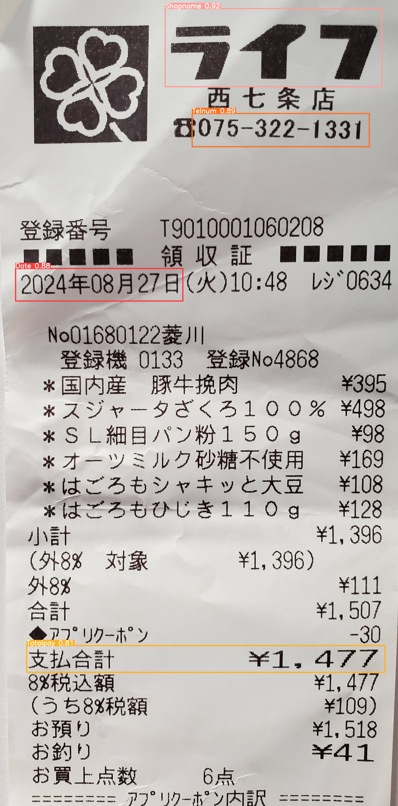
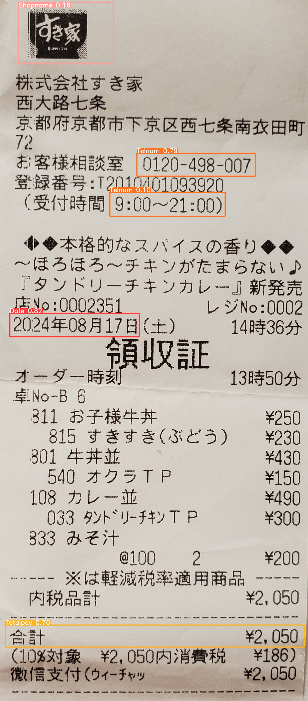
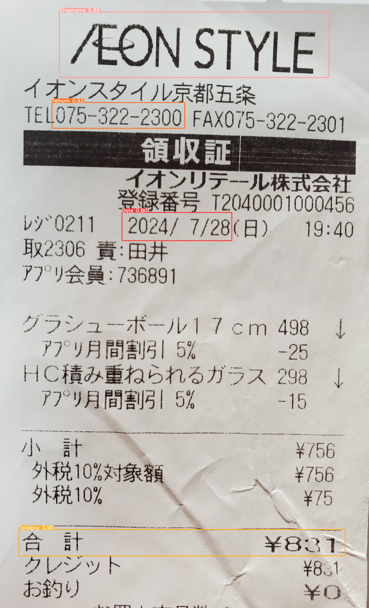
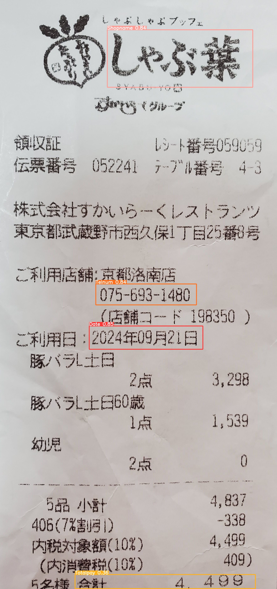

# Receipt Text Region Detection Model with YOLOv9

[【日本語】](README.md) | [【中文】](README.zh.md) | [【English】](README.en.md)

---

## Summary

<div style="max-width: 600px; word-wrap: break-word;">
This article documents the construction of a receipt text region detection model using YOLO v9 (GELAN-C). Approximately 120 receipts were collected and annotated with 4 classes (labels) — Date, Shopname, Telnum, and Totalpay — to train a text region detection model.

The model accurately detects all 4 specified classes. Inference can also be run in a local environment.
</div>

<div align="medium">
    
</div>

This project is based on [YOLOv9](https://github.com/WongKinYiu/yolov9).

---

## Introduction

### About YOLO v9
<div style="max-width: 600px; word-wrap: break-word;">
YOLO stands for "You Only Look Once," a state-of-the-art object detection model known for its speed and accuracy. Version 9 (v9) introduces new architectures such as "Programmable Gradient Information (PGI)" and "Generalized Efficient Layer Aggregation Network (GELAN)," further enhancing its capabilities. This project uses the GELAN-C architecture.
</div>

---

## Preparation

<div style="max-width: 600px; word-wrap: break-word;">

### Training with Google Colab

Google Colab is a cloud-based platform that provides free GPU access. This project used Google Colab's T4 GPU for training the deep learning model.

### Data Preparation

#### 1. Collecting Receipt Data

Over 120 shopping receipts were collected, and high-quality images were selected for use.

#### 2. Annotation with LabelImg

LabelImg was used as the annotation tool with VOC XML format. Four classes were defined:

| Class ID | Label | Description |
|:--------:|:-----:|:-----------:|
| 0 | Date | Date on the receipt |
| 1 | Shopname | Store/shop name |
| 2 | Telnum | Phone number |
| 3 | Totalpay | Total payment amount |

#### 3. Dataset Structure

After annotation, the dataset was split into training, validation, and test sets. Images were resized to 640x640 for training.

</div>

---

## Training Pipeline

The following steps describe how the YOLO v9 model was trained on Colab.

### 1. Mount Google Drive

```python
from google.colab import drive
drive.mount('/content/drive')
```

### 2. Clone YOLOv9 Repository and Install Dependencies

```python
!git clone https://github.com/WongKinYiu/yolov9
%cd yolov9
!pip install -r requirements.txt -q
```

### 3. Download Pre-trained Weights

Download the pre-trained GELAN-C weights.

```python
!wget -P {HOME}/weights -q https://github.com/WongKinYiu/yolov9/releases/download/v0.1/gelan-c.pt
```

### 4. Prepare Dataset

Convert the VOC XML format annotations from LabelImg to YOLO format and upload to Colab with the following directory structure:

```
dataset/
├── images/
│   ├── train/    (Training images)
│   ├── val/      (Validation images)
│   └── test/     (Test images)
└── labels/
    ├── train/    (Training labels)
    ├── val/      (Validation labels)
    └── test/     (Test labels)
```

### 5. Start Training

Run the following command to train the model for 100 epochs with a batch size of 8.

```python
%cd {HOME}/yolov9

!python train.py \
--batch 8 --epochs 100 --img 640 --device 0 --min-items 0 --close-mosaic 15 \
--data /content/dataset/data.yaml \
--weights {HOME}/weights/gelan-c.pt \
--cfg models/detect/gelan-c.yaml \
--hyp hyp.scratch-high.yaml
```

---

## Training Results

After 100 epochs of training, all classes achieved high mean Average Precision (mAP).

| Class | Precision | Recall | mAP@0.5 |
|:-----:|:---------:|:------:|:-------:|
| Date | 0.995 | 1.000 | 0.995 |
| Shopname | 0.995 | 1.000 | 0.995 |
| Telnum | 0.995 | 1.000 | 0.995 |
| Totalpay | 0.995 | 1.000 | 0.995 |
| **All** | **0.988** | **0.989** | **0.993** |

---

## Verification with Test Images

Validate the trained model on test images.

```python
!python detect.py \
--img 640 --conf 0.5 --device 0 \
--weights {HOME}/yolov9/runs/train/exp/weights/best.pt \
--source {HOME}/yolov9/dataset/test/images
```

### Local Inference

Place the trained weights (`best_text.pt`) locally and run inference with the following command:

```bash
python detect.py \
    --weights best_text.pt \
    --source test_images \
    --data data/text_data.yaml \
    --conf-thres 0.1 \
    --save-txt \
    --save-crop \
    --project runs/detect \
    --name text_result \
    --exist-ok
```

<div align="medium">
    
    
</div>

<div align="medium">
    
    
</div>

The results show that with a low confidence threshold (conf-thres=0.1), all 4 classes are detected without any missed detections.

---

## Project Structure

```
Receipt_detection_model-main/
├── data/
│   └── text_data.yaml        # Class definition file (4 classes)
├── images/                   # Detection result images
├── models/
│   ├── common.py             # Common modules
│   ├── experimental.py       # Experimental modules
│   └── yolo.py               # YOLO model definition
├── test_images/              # Test images for inference
├── utils/                    # Utility modules
├── best_text.pt              # Trained weights
├── detect.py                 # Inference script
├── train.py                  # Training script
└── val.py                    # Validation script
```

---

## Reference

<details><summary> <b>Expand</b> </summary>

* [https://github.com/WongKinYiu/yolov9](https://github.com/WongKinYiu/yolov9)
* [https://github.com/AlexeyAB/darknet](https://github.com/AlexeyAB/darknet)
* [https://github.com/VDIGPKU/DynamicDet](https://github.com/VDIGPKU/DynamicDet)
* [https://github.com/DingXiaoH/RepVGG](https://github.com/DingXiaoH/RepVGG)
* [LabelImg](https://github.com/tzutalin/labelImg)
</details>
